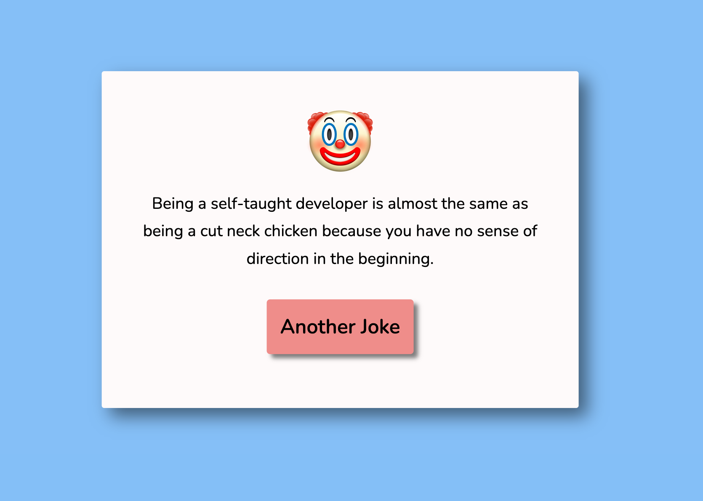

# Random-Joke-Generator

Building a Random Joke Generator using HTML, CSS and Vanilla Javascript.

First step: create HTML. Second step: create CSS. Third step: implement the functionality using Javascript.
